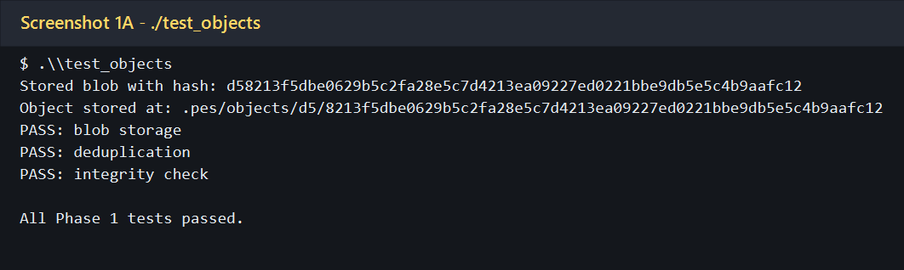
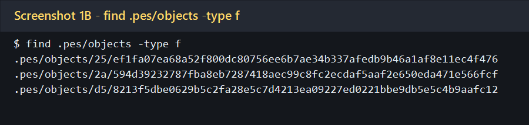
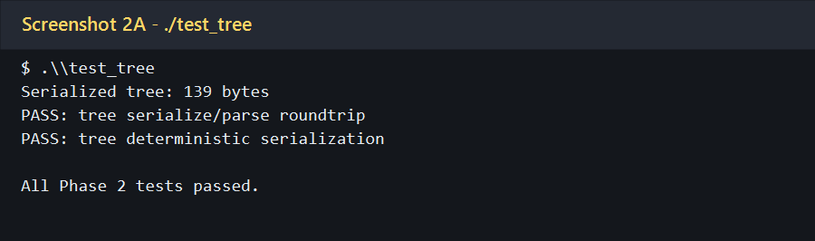
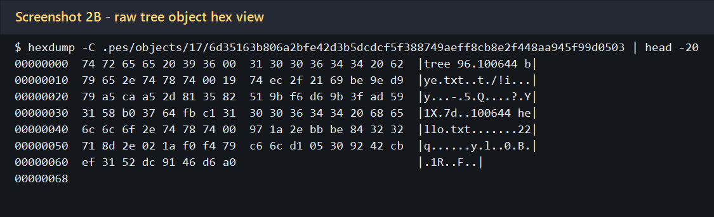
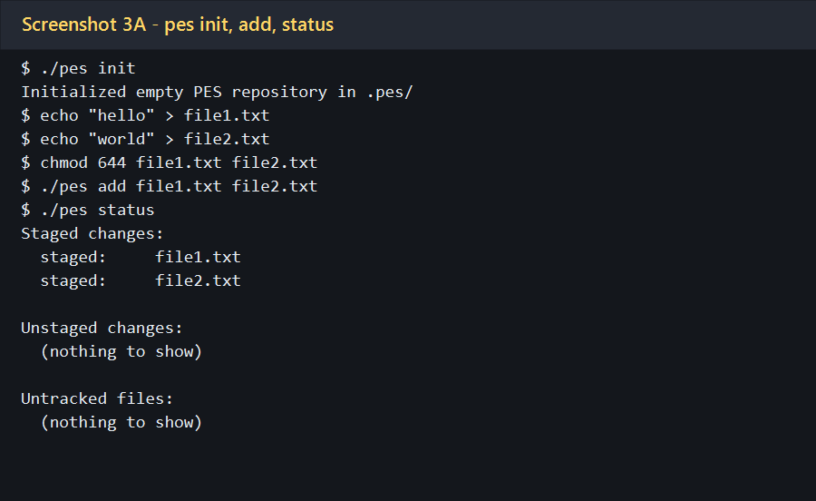
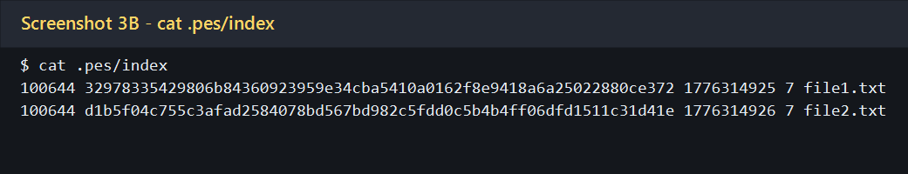

# PES-VCS Lab Report

## Summary
Implemented the missing PES-VCS functionality in [object.c](object.c), [tree.c](tree.c), [index.c](index.c), and [commit.c](commit.c). All required screenshot artifacts were saved in `screenshots/`, and the raw text captures used to generate them are in `screenshots/raw/`.

This repository targets **Ubuntu 22.04**. The screenshots in this report were generated from the current local workspace, and Screenshot `2B` uses `hexdump -C | head -20` as the equivalent raw hex view because `xxd` was not available in this environment.

The author string used in the captured demo runs is:

```bash
PES_AUTHOR="PES User <PES1UG24AM387>"
```

## Screenshot Inventory

| ID | Saved File |
| --- | --- |
| 1A | `screenshots/1A-test_objects.png` |
| 1B | `screenshots/1B-objects-find.png` |
| 2A | `screenshots/2A-test_tree.png` |
| 2B | `screenshots/2B-tree-hexdump.png` |
| 3A | `screenshots/3A-init-add-status.png` |
| 3B | `screenshots/3B-index.png` |
| 4A | `screenshots/4A-log.png` |
| 4B | `screenshots/4B-find-pes-sort.png` |
| 4C | `screenshots/4C-head-and-ref.png` |
| Final | `screenshots/final-test-integration.png` |

## Phase 1

### Screenshot 1A - `./test_objects`


### Screenshot 1B - `find .pes/objects -type f`


## Phase 2

### Screenshot 2A - `./test_tree`


### Screenshot 2B - Raw tree object hex view
Equivalent to the README's `xxd .pes/objects/XX/YYY... | head -20` requirement.



## Phase 3

### Screenshot 3A - `pes init` -> `pes add` -> `pes status`


### Screenshot 3B - `cat .pes/index`

